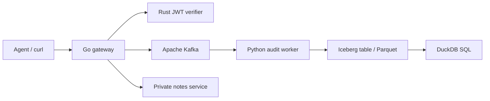

# KeyTrace

A small, working security gateway for agent actions. It verifies signed tokens, checks action permissions, forwards permitted requests to a notes service, and stores access decisions in a queryable audit table.

**Go · Rust · Apache Kafka · Apache Iceberg · Parquet**



## What it does

- **Go:** HTTP gateway with a default-deny action policy, request limits, timeouts, and synchronous Kafka publishing before forwarding.
- **Rust:** verifies HS256 JWT signatures, expiration, issuer, and audience. Signed claims contain the agent identity and permitted actions.
- **Kafka:** buffers authorization events in `keytrace.audit`; a consumer group tracks ingestion progress.
- **Iceberg + Parquet:** the worker commits batches into an actual Iceberg table with snapshots, a local SQLite catalog, and Parquet data files.
- **SQL:** DuckDB queries the current Iceberg snapshot through Arrow.
- **Working upstream:** create and list notes, persisted in SQLite across restarts.

## Run

Requires Docker with Compose and Python 3. No local Go or Rust installation is needed. Run commands from this directory.

```sh
python3 scripts/setup.py
docker compose up --build -d
python3 scripts/smoke.py
```

The initial build downloads the toolchains and dependencies. The smoke test creates a note, reads it back, verifies denied/expired/invalid requests, and waits until all six access decisions are queryable in Iceberg. Go and Rust unit tests also run during the image builds.

## Try it

```sh
TOKEN=$(python3 scripts/issue_token.py)

curl -s http://localhost:8080/actions \
  -H "Authorization: Bearer $TOKEN" \
  -H 'Content-Type: application/json' \
  -d '{"action":"notes.create","text":"Review the deployment checklist"}'

curl -s http://localhost:8080/actions \
  -H "Authorization: Bearer $TOKEN" \
  -H 'Content-Type: application/json' \
  -d '{"action":"notes.list"}'
```

A restricted token can only list notes:

```sh
READ_TOKEN=$(python3 scripts/issue_token.py notes.list)
curl -i http://localhost:8080/actions \
  -H "Authorization: Bearer $READ_TOKEN" \
  -H 'Content-Type: application/json' \
  -d '{"action":"notes.create","text":"This is denied"}'
```

Expected: `403 policy_denied`. Invalid/expired tokens return `401`. Unknown actions are denied even if the token contains them. If audit publishing fails, the gateway returns `503` and does not execute the action.

## Query audit logs

```sh
docker compose exec audit python query.py

docker compose exec audit python query.py \
  "SELECT DISTINCT event_id, agent, action, decision, reason FROM audit ORDER BY event_id"
```

Events include a unique ID, UTC timestamp, agent, action, decision, and reason. Tokens and note contents are never included in audit events. The response header `X-KeyTrace-Event` identifies the authorization record.

## Project layout

| Directory | Responsibility |
| --- | --- |
| `proxy/` | Go gateway and policy tests |
| `verifier/` | Rust verifier and cryptographic validation tests |
| `audit/` | Kafka consumer, Iceberg storage, SQL queries, notes service |
| `scripts/` | Secret setup, token issuance, end-to-end test |
| `.github/workflows/` | Container build and integration tests |

## Design boundaries

This is a focused local project, not a production security platform. Kafka runs as one broker; Iceberg uses local Docker storage and a SQLite catalog. Only the gateway port is published, on localhost. The token issuer is an offline administrator utility, not a public endpoint. The secret is randomly generated in an ignored `.env` file.

Audit delivery is **at least once**: a worker crash after an Iceberg commit but before a Kafka offset commit can produce duplicate rows. Use `event_id` to deduplicate; the default query does this. An `allow` event records permission to execute, not successful completion of the upstream operation. Malformed HTTP payloads are rejected before the authorization flow and are not audited. Requests are not idempotent, so retrying note creation may create another note. The worker is intentionally a single writer and batches up to 100 events per poll; a low request rate produces small Parquet files.

No throughput or latency benchmark claims are made. Production extensions would include asymmetric keys, TLS, key rotation, replicated Kafka, object storage, a shared catalog, and compaction.

## Stop or reset

```sh
docker compose down       # keep notes, Kafka events, and Iceberg data
docker compose down -v    # delete all project data
```

## Resume wording

> Built a Go authorization gateway with Rust JWT verification and action-level policies; streamed access decisions through Apache Kafka into Apache Iceberg tables backed by Parquet, with SQL audit queries and automated integration tests.

## References

- [Apache Kafka Docker quick start](https://kafka.apache.org/39/getting-started/quickstart/)
- [PyIceberg configuration](https://py.iceberg.apache.org/configuration/)
- [PyIceberg table operations](https://py.iceberg.apache.org/api/)
